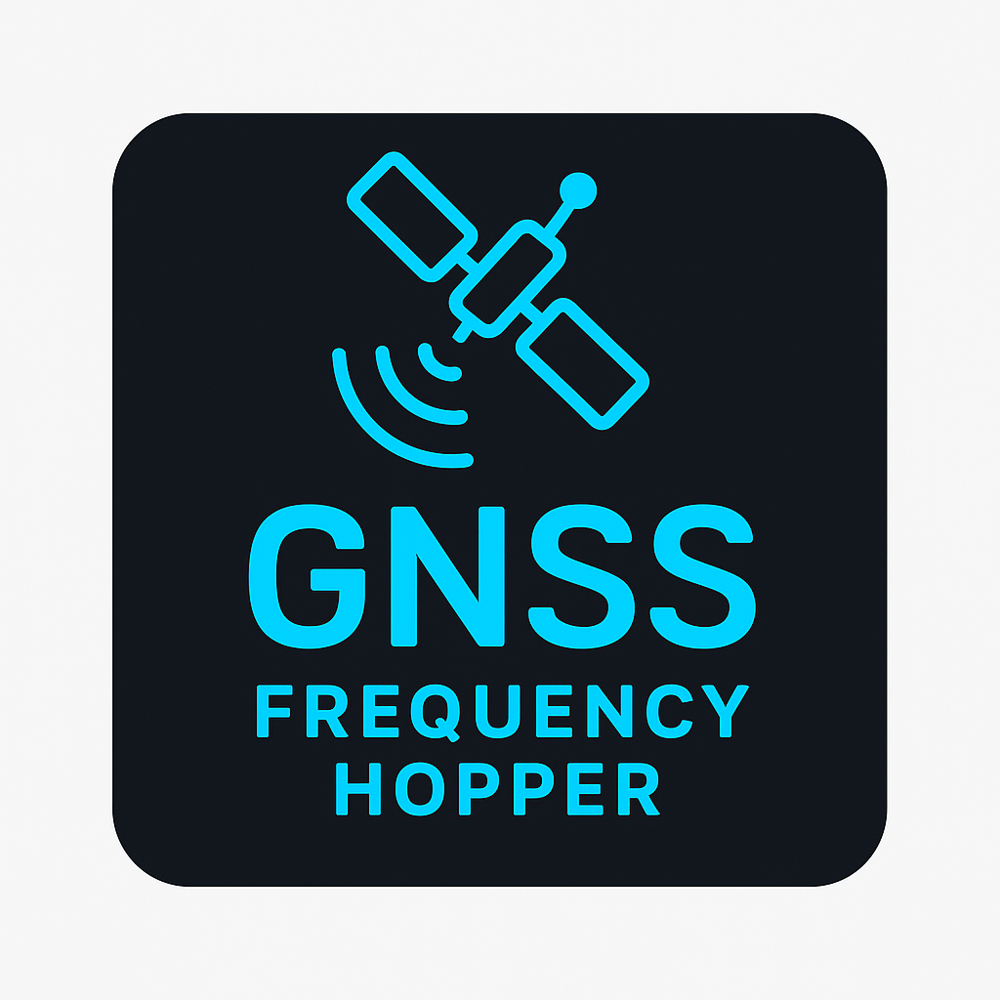
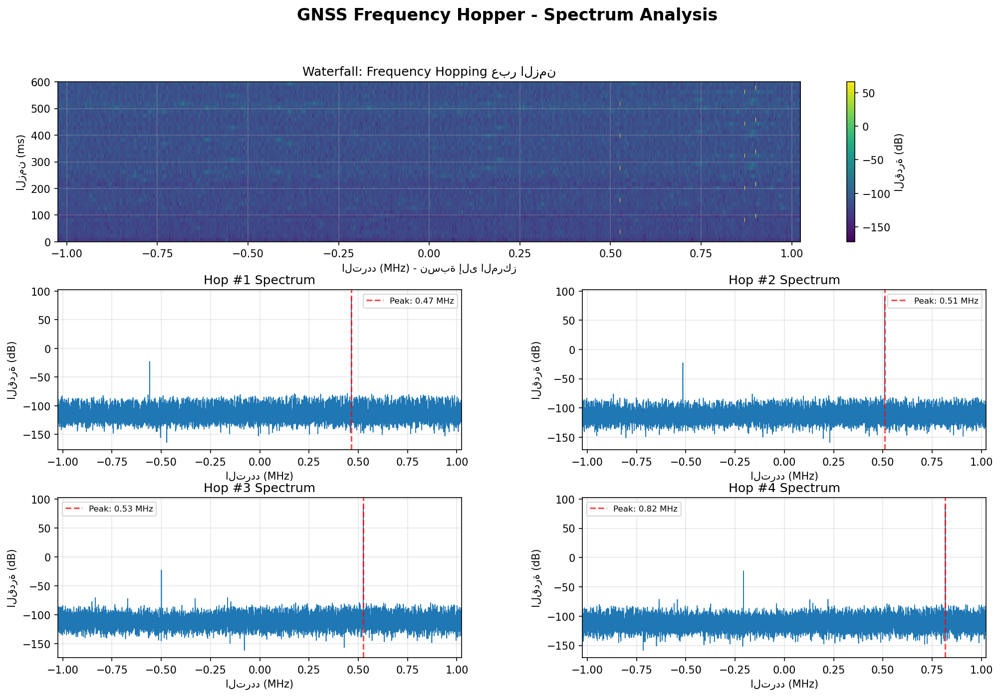

<p align="center">
  
</p>

<h1 align="center">🛰️ GNSS Frequency Hopper</h1>
<p align="center">
  <b>Python + GNU Radio</b> project for frequency hopping across GNSS bands (GPS / GLONASS / Galileo)
</p>

---

## 🌍 الفكرة

مشروع لتطبيق مفهوم <b>تبديل التردد (Frequency Hopping)</b> ضمن نطاقات GNSS باستخدام Python و GNU Radio.  
يقوم البرنامج بتغيير التردد كل <b>15ms</b> بشكل متتابع عبر مجموعة من الترددات المعرفة في المصفوفة:

```python
freq_array = [1602.0, 1575.42, 1561.1, 1246.0, 1227.6, 1207.14, 1176.45, 1191.0]
```
الهدف هو دراسة السلوك الزمني والتحليلي لتبديل التردد ضمن بيئة اختبار إشارات GNSS.

⚙️ المتطلبات
يُنصح باستخدام بيئة Conda لتثبيت GNU Radio بسهولة:

bash
Copy code
conda create -n gnuradio python=3.10
conda activate gnuradio
conda install -c conda-forge gnuradio numpy matplotlib
🚀 التشغيل
يمكنك تشغيل المشروع بطريقتين:

1️⃣ من خلال GNU Radio Companion (GRC)
افتح الملف:

Copy code
test_hopper.grc
وشغّله من داخل GNU Radio Companion.

2️⃣ من خلال Python مباشرة
لتجربة البرنامج بشكل مستقل:

bash
Copy code
python test_hopper_standalone.py
ستظهر نتائج مثل:

bash
Copy code
[Hop #1] تبديل إلى: 1575.42 MHz
[Hop #2] تبديل إلى: 1561.10 MHz
...
✅ الاختبار اكتمل بنجاح!
📁 تم حفظ البيانات في: gnss_hopper_output.dat
📊 تحليل النتائج
بعد التشغيل، يمكنك تحليل البيانات المخرجة:

bash
Copy code
python analyze_output.py gnss_hopper_output.dat
سيُظهر الرسم البياني للترددات المتغيرة زمنياً.

📺 صور النتائج والتحليل
يوضّح الرسم البياني التالي كيفية تبديل الترددات كل 15ms عبر نطاقات GNSS المختلفة:

<p align="center">  </p>
كما يتم حفظ نتائج التجربة في الملف:

Copy code
gnss_hopper_output.dat
🧠 ملاحظات تقنية
زمن القفزة الواحدة: 15ms

معدل العينات (Sample Rate): 2.048 MHz

كل إشارة تُضرب بقيمة التردد المختار لتوليد خرج ترددي جديد.

تم اختبار المشروع بنجاح على بيئة Windows + Conda.

📜 الترخيص
هذا المشروع مرخّص تحت رخصة MIT License.
يمكنك استخدامه أو تعديله بحرية للأغراض الأكاديمية أو البحثية.

<p align="center"> <b>🚀 Developed by Abdallah Sobaih</b><br/> <a href="https://github.com/abdsoobaih12/gnss-freq-hopper">🔗 GitHub Repository</a> </p> ```
