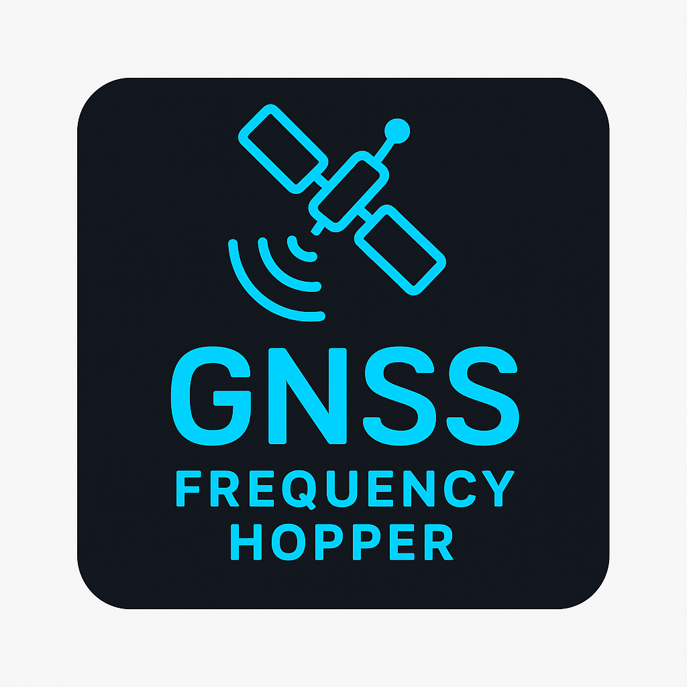
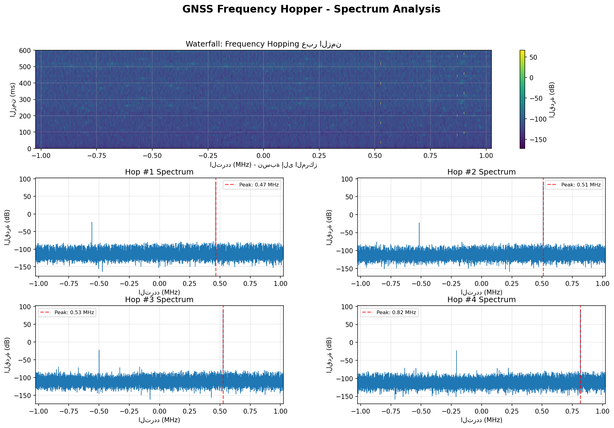

<p align="center">
  
</p>

<h1 align="center">🛰️ GNSS Frequency Hopper</h1>
<p align="center">
  <b>Python + GNU Radio</b> project for frequency hopping across GNSS bands (GPS / GLONASS / Galileo)
</p>

---

## 🌍 Overview

A project implementing the concept of <b>Frequency Hopping</b> across GNSS bands using Python and GNU Radio.  
The program sequentially changes the frequency every <b>15ms</b> across a set of frequencies defined in the following array:
```python
freq_array = [1602.0, 1575.42, 1561.1, 1246.0, 1227.6, 1207.14, 1176.45, 1191.0]
```
The goal is to study the temporal and analytical behavior of frequency hopping within a GNSS signal testing environment.

⚙️ Prerequisites
It is highly recommended to use a Conda environment to easily install GNU Radio:
```
conda create -n gnuradio python=3.10
conda activate gnuradio
conda install -c conda-forge gnuradio numpy matplotlib
 ```
🚀 How to Run
You can run the project in two ways:

1️⃣ Through GNU Radio Companion (GRC)
Open the file:
```
test_hopper.grc
```
and execute it from within GNU Radio Companion.

2️⃣ Directly via Python
To test the program independently:
```
python test_hopper_standalone.py
```
You will see an output like this:
```
[Hop #1] Switched to: 1575.42 MHz
[Hop #2] Switched to: 1561.10 MHz
...
✅ Test completed successfully!
📁 Data saved to: gnss_hopper_output.dat
```
📊 Output Analysis
After running the program, you can analyze the output data:
```
python analyze_output.py gnss_hopper_output.dat
```
This will display a graph of the time-varying frequencies.

📺 Results and Analysis Images
The following graph illustrates how the frequencies switch every 15ms across the different GNSS bands:


The experiment results are also saved in the file:
```
gnss_hopper_output.dat
```
🧠 Technical Notes
Single Hop Duration: 15ms

Sample Rate: 2.048 MHz

Each signal is multiplied by the chosen frequency value to generate a new frequency output.

The project was successfully tested on a Windows + Conda environment.

📜 License
This project is licensed under the MIT License.
You are free to use or modify it for academic or research purposes.
